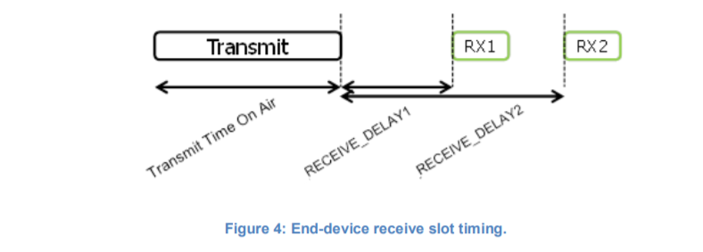

# Physical Message Formats

    The LoRa terminology distinguishes between uplink and downlink messages.
    LoRa术语区分上行链路和下行链路消息。

## 3.1 Uplink Messages

    Uplink messages are sent by end-devices to the network server relayed by one or many gateways.
    上行链路消息由终端设备发送到由一个或多个网关中继的网络服务器。

    Uplink messages use the LoRa radio packet explicit mode in which the LoRa physical header
    (PHDR) plus a header CRC (PHDR_CRC) are included. The integrity of the payload is protected by a CRC.
    上行链路消息使用LoRa无线分组显式模式，
    其中LoRa物理报头（PHDR）加上报头CRC（PHDR_CRC）是包括在内有效载荷的完整性由CRC保护。

    The PHDR, PHDR_CRC and payload CRC fields are inserted by the radio transceiver.
    PHDR、PHDR_CRC和有效负载CRC字段由无线收发器插入。

    Uplink PHY:
    | Preamble | PHDR | PHDR_CRC | PHYPayload | CRC |

## 3.2 Downlink Messages

    Each downlink message is sent by the network server to only one end-device and is relayed
    by a single gateway.
    每个下行链路消息由网络服务器仅发送到一个终端设备，并由单个网关中继。

    Downlink messages use the radio packet explicit mode in which the LoRa physical header
    (PHDR) and a header CRC (PHDR_CRC) are included.
    下行链路消息使用无线电分组显式模式，其中包括LoRa物理报头（PHDR）和报头CRC（PHDR_CRC）。

    Downlink PHY:
    | Preamble | PHDR | PHDR_CRC | PHYPayload |

## 3.3 Receive Windows

    Following each uplink transmission the end-device opens two short receive windows. The
    receive window start times are defined using the end of the transmission as a reference.
    在每次上行链路传输之后，终端设备打开两个短接收窗口。接收窗口开始时间以传输结束作为参考来定义。

## 3.3.1 First receive window channel, data rate, and start

    The first receive window RX1 uses a frequency that is a function of the uplink frequency and
    a data rate that is a function of the data rate used for the uplink. RX1 opens RECEIVE_DELAY1
    seconds (+/- 20 microseconds) after the end of the uplink modulation.
    The relationship between uplink and RX1 slot downlink data rate is region specific and detailed
    in the “LoRaWAN regional physical layer specification” document. By default the first receive
    window datarate is identical to the datarate of the last uplink.
    第一个接收窗口RX1使用作为上行链路频率的函数的频率和作为用于上行链路的数据速率的函数的数据速率。
    在上行调制结束后，RX1打开接收延迟1秒后（+/-20微秒）。上行链路和RX1时隙下行链路数据速率之间的关系是特定于区域的，
    并在“LoRaWAN区域物理层规范”文档中详细说明。默认情况下，第一个接收窗口数据速率与上一次上行链路的数据速率相同。

## 3.3.2 Second receive window channel, data rate, and start
