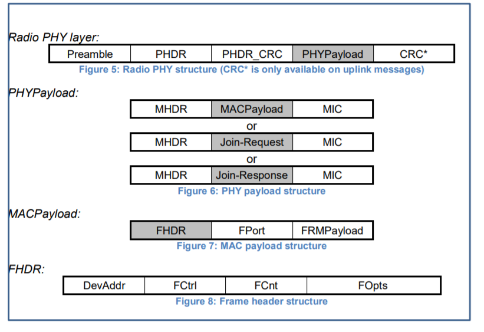

# MAC Message Formats

    All LoRa uplink and downlink messages carry
    a PHY payload (Payload) starting with a single-octet MAC header (MHDR),
    followed by a MAC payload (MACPayload), and ending with a 4-octet message integrity code (MIC).
    所有LoRa上行链路和下行链路消息都携带一个PHY有效载荷（payload），从单八位字节MAC报头（MHDR）开始，
    然后是MAC有效载荷（MAC payload），最后是4个八位字节的消息完整性代码（MIC）。

## 4.1 MAC Layer (PHYPayload)

    | Size(bytes) |   1   |   1 .. N   |   4   |
    |------------------------------------------|
    | PHYPayload  |  MHDR | MACPayload |  MIC  |

    The maximum length (M) of the MACPayload field is region specific and is specified in Chapter 6.
    MACPayload字段的最大长度（M）因地区而异，在第6章中有规定。

## 4.2 MAC Header (MHDR field)

    |    Bit#   |  7..5  | 4..2 |  1..0  |
    |------------------------------------|
    | MHDR Bit  |  Mtype | RFU  |  Major |

    The MAC header specifies the message type (MType) and according to which
    major version (Major) of the frame format of the LoRaWAN layer specification the frame has been encoded.
    MAC报头指定消息类型（MType）以及根据LoRaWAN层规范的帧格式的主要版本（major）对帧进行编码。

### 4.2.1 Message type (MType bit field)

    The LoRaWAN distinguishes between six different MAC message types: join request, join accept,
    unconfirmed data up/down, and confirmed data up/down.
    LoRaWAN区分了六种不同的MAC消息类型：加入请求/接受、未确认数据上/下、确认数据上/下。

    |  Mtype  |       Description        |
    |------------------------------------|
    |   000   |       Join Request       |
    |   001   |       Join Accept        |
    |   010   |   Unconfirmed Data Up    |
    |   011   |   Unconfirmed Data Down  |
    |   100   |   Confirmed Data Up      |
    |   101   |   Confirmed Data Down    |
    |   110   |           RFU            |
    |   111   |   Proprietary(专有的)    |

#### 4.2.1.1 Join-request and join-accept messages

    The join-request and join-accept messages are used by the over-the-air activation procedure
    described in Chapter 6.2.
    加入请求和加入接受消息用于第6.2章中所述的“空中传送”激活过程。

#### 4.2.1.2 Data messages

    Data messages are used to transfer both MAC commands and application data, which can be
    combined together in a single message. A confirmed-data message has to be
    acknowledged by the receiver, whereas an unconfirmed-data message does not require an acknowledgment.
    Proprietary messages can be used to implement non-standard message
    formats that are not interoperable with standard messages but must only be used among
    devices that have a common understanding of the proprietary extensions.
    数据消息用于传输MAC命令和应用程序数据，它们可以组合在一条消息中。
    已确认的数据消息必须由接收方确认，而未确认的数据消息不需要确认。
    专有消息可用于实现与标准消息不可互操作的非标准消息格式，但只能在对专有扩展有共同理解的设备之间使用。

    Message integrity is ensured in different ways for different message types and is described
    per message type below.
    对于不同的消息类型，以不同的方式确保消息的完整性，下面对每个消息类型进行了描述。

### 4.2.2 Major version of data message (Major bit field)

    |  Major bits  |     Description     |
    |------------------------------------|
    |      00      |     LoRaWAN R1      |
    |    01..11    |        RFU          |

    Note: The Major version specifies the format of the messages
    exchanged in the join procedure (see Chapter 6.2) and the first four
    bytes of the MAC Payload as described in Chapter 4. For each major
    version, end-devices may implement different minor versions of the
    frame format. The minor version used by an end-device must be made
    known to the network server beforehand using out of band messages
    (e.g., as part of the device personalization information).
    注：主版本指定了在连接过程中交换的消息的格式（见第6.2章）和第4章中描述的MAC有效载荷的前四个字节。
    对于每个主要版本，终端设备可以实现帧格式的不同次要版本。
    终端设备使用的次要版本必须事先使用带外消息（例如，作为设备个性化信息的一部分）通知网络服务器。

## 4.3 MAC Payload of Data Messages (MACPayload)

    The MAC payload of the data messages, a so-called “data frame”, contains a frame header (FHDR)
    followed by an optional port field (FPort) and an optional frame payload field (FRMPayload).
    数据消息的MAC有效载荷，即所谓的“数据帧”，包含帧头（FHDR），
    后跟可选端口字段（FPort）和可选帧有效载荷字段（FRMPayload）。

### 4.3.1 Frame header (FHDR)

    The FHDR contains the short device address of the end-device (DevAddr), a frame control
    octet (FCtrl), a 2-octets frame counter (FCnt), and up to 15 octets of frame options (FOpts)
    used to transport MAC commands.
    FHDR包含终端设备的短设备地址（DevAddr）、帧控制1个八位字节（FCtrl）、
    2个八位字节帧计数器（FCnt）和用于传输MAC命令的多达15个八位字节的帧选项（FOpts）。
    |  Size bytes  |    1    |   1   |   2   |  1..15  |
    |--------------------------------------------------|
    |     FHDR     | DevAddr | FCtrl | Fcnt  |  FOpts  |

    For downlink frames the FCtrl content of the frame header is:
    对于下行帧，帧头的FCtrl内容为：
    |    Bit#    |   7   |   6   |   5   |    4     |   3..0   |
    |----------------------------------------------------------|
    | FCtrl bits |  ADR  |  RFU  |  ACK  | FPending | FOptsLen |

    For uplink frames the FCtrl content of the frame header is:
    对于上行链路帧，帧头的FCtrl内容为：
    |    Bit#    |   7   |     6     |   5   |   4    |   3..0   |
    |------------------------------------------------------------|
    | FCtrl bits |  ADR  | ADRACKReq |  ACK  | ClassB | FOptsLen |

#### 4.3.1.1 Adaptive data rate control in frame header (ADR, ADRACKReq in FCtrl)

    LoRa network allows the end-devices to individually use any of the possible data rates. This
    feature is used by the LoRaWAN to adapt and optimize the data rate of static end-devices.
    This is referred to as Adaptive Data Rate (ADR) and when this is enabled the network will be
    optimized to use the fastest data rate possible.
    LoRa网络允许终端设备单独使用任何可能的数据速率。
    LoRaWAN使用此功能来调整和优化静态终端设备的数据速率。
    这被称为自适应数据速率（ADR），当它被启用时，网络将被优化以使用尽可能快的数据速率。

    Adaptive Data Rate control may not be possible when the radio channel attenuation changes
    fast and constantly. When the network is unable to control the data rate of a device , the
    device’s application layer should control it. It is recommended to use a variety of different data
    rates in this case. The application layer should always try to minimize the aggregated air time
    used given the network conditions.
    当无线信道衰减快速且持续变化时，自适应数据速率控制可能无法实现。
    当网络无法控制设备的数据速率时，设备的应用层应该控制它。
    在这种情况下，建议使用各种不同的数据速率。应用层应始终在给定的网络条件下尽量减少所使用的聚合广播时间。

    If the ADR bit is set, the network will control the data rate of the end-device through the
    appropriate MAC commands. If the ADR bit is not set, the network will not attempt to control
    the data rate of the end-device regardless of the received signal quality. The ADR bit MAY be
    set and unset by the end-device or the Network on demand. However, whenever possible, the
    ADR scheme should be enabled to increase the battery life of the end-device and maximize
    the network capacity.
    如果设置了ADR位，网络将通过适当的MAC命令控制终端设备的数据速率。
    如果未设置ADR位，则无论接收到的信号质量如何，网络都不会尝试控制终端设备的数据速率。
    ADR位可由终端设备或网络按需设置和取消设置。
    然而，只要可能，应启用ADR方案，以延长终端设备的电池寿命并最大限度地提高网络容量。

    Note: Even mobile end-devices are actually immobile most of the time.
    So depending on its state of mobility, an end-device can request the
    network to optimize its data rate using ADR.
    注意：即使是移动终端设备实际上大部分时间都是不移动的。
    因此，根据其移动状态，终端设备可以使用ADR请求网络优化其数据速率。

    If an end-device whose data rate is optimized by the network to use a data rate higher than
    its lowest available data rate, it periodically needs to validate that the network still receives the
    uplink frames. Each time the uplink frame counter is incremented (for each new uplink,
    repeated transmissions do not increase the counter), the device increments an
    ADR_ACK_CNT counter. After ADR_ACK_LIMIT uplinks (ADR_ACK_CNT >=
    ADR_ACK_LIMIT) without any downlink response, it sets the ADR acknowledgment request
    bit (ADRACKReq). The network is required to respond with a downlink frame within the next
    ADR_ACK_DELAY frames, any received downlink frame following an uplink frame resets the
    ADR_ACK_CNT counter. The downlink ACK bit does not need to be set as any response
    during the receive slot of the end-device indicates that the gateway has still received the
    uplinks from this device. If no reply is received within the next ADR_ACK_DELAY uplinks (i.e.,
    after a total of ADR_ACK_LIMIT + ADR_ACK_DELAY), the end-device MAY try to regain
    connectivity by switching to the next lower data rate that provides a longer radio range. The
    end-device will further lower its data rate step by step every time ADR_ACK_DELAY is reached.
    The ADRACKReq SHALL not be set if the device uses its lowest available data rate
    because in that case no action can be taken to improve the link range.
    如果终端设备的数据速率被网络优化以使用高于其最低可用数据速率的数据速率，
    则它需要周期性地验证网络是否仍然接收到上行链路帧。
    每当上行链路帧计数器增加时（对于每个新的上行链路，重复传输不会增加计数器），设备增加一个ADR_ACK_CNT计数器。
    在ADR_ACK_LIMIT上行链路（ADR_ACK_CNT>=ADR_ACK_LIMIT）没有任何下行链路响应后，它设置ADR确认请求位（ADRACKReq）。
    网络需要在下一个ADR_ACK_DELAY帧内用下行链路帧响应，上行链路帧之后的任何接收到的下行链路帧都会重置ADR_ACK_CNT计数器。
    下行链路ACK比特不需要被设置为在终端设备的接收时隙期间的任何响应指示网关仍然从该设备接收到上行链路。
    如果在下一个ADR_ACK_DELAY上行链路（即, 在总的ADR_ACK_LIMIT+ADR_ACK_延迟之后)仍然没有响应。
    下一个终端可能会尝试通过较低的无线交换速率来恢复数据的连接速率。
    每次达到ADR_ACK_DELAY时，终端设备将进一步逐步降低其数据速率。
    如果设备使用其最低可用数据速率，则不应设置ADRACKReq，因为在这种情况下，无法采取任何措施来改善链路范围。

    Note: Not requesting an immediate response to an ADR acknowledgement
    request provides flexibility to the network to optimally schedule its downlinks.
    注：不请求对ADR确认请求的立即响应为网络提供了灵活性，以优化其下行链路。

    Note: In uplink transmissions the ADRACKReq bit is set if ADR_ACK_CNT >= ADR_ACK_LIMIT and
    the current data-rate is greater than the device defined minimum data rate, it is cleared in other conditions.
    注：在上行链路传输中，如果ADR_ACK_CNT>=ADR_ACK_LIMIT且当前数据速率大于设备定义的最小数据速率，
    则设置ADRACKReq位，在其他情况下清除。

#### 4.3.1.2 Message acknowledge bit and acknowledgement procedure (ACK in FCtrl)

    When receiving a confirmed data message, the receiver SHALL respond with a data frame
    that has the acknowledgment bit (ACK) set. If the sender is an end-device, the network will
    send the acknowledgement using one of the receive windows opened by the end-device after
    the send operation. If the sender is a gateway, the end-device transmits an acknowledgment
    at its own discretion.
    当接收到确认的数据消息时，接收器应使用设置了确认位（ACK）的数据帧进行响应。
    如果发送方是终端设备，则网络将在发送操作后使终端设备打开的一个接收窗口发送确认。
    如果发送方是网关，终端设备将自行决定发送一个确认。

    Acknowledgements are only sent in response to the latest message received and are never retransmitted.
    确认只会回应收到的最新讯息，不会重新传送。

    Note: To allow the end-devices to be as simple as possible and have as
    few states as possible it may transmit an explicit (possibly empty)
    acknowledgement data message immediately after the reception of a
    data message requiring a confirmation. Alternatively the end-device may
    defer the transmission of an acknowledgement to piggyback it with its next data message.
    注：为了使终端设备尽可能简单且状态尽可能少，
    它可以在接收到需要确认的数据消息之后立即发送显式（可能是空的）确认数据消息。
    可选地，终端设备可以延迟确认的传输，以将其与下一个数据消息相结合。

#### 4.3.1.3 Retransmission procedure(重传程序)

    The number of retransmissions (and their timing) for the same message where an
    acknowledgment is requested but not received is at the discretion of the end device and may
    be different for each end-device.
    在请求确认但未接收到的情况下，同一消息的重传次数（及其定时）由终端设备自行决定，
    并且对于每个终端设备可能不同。

    Note: Some example timing diagrams of the acknowledge mechanism are given in Chapter 18.
    注：第18章给出了应答机制的一些时序图示例。

    Note: If an end-device has reached its maximum number of retransmissions without
    receiving an acknowledgment,
    it can try to regain connectivity by moving to a lower data rate with longer reach.
    It is up to the end-device to retransmit the message again or to forfeit that message and move on.
    注意：如果终端设备在没有收到确认的情况下达到了其最大的重传次数，
    它可以尝试通过移动到具有更长距离的较低数据速率来恢复连接。
    由终端设备来重新传输消息，或者放弃该消息并继续前进。

    Note: If the network server has reached its maximum number of
    retransmissions without receiving an acknowledgment, it will generally
    consider the end-device as unreachable until it receives further
    messages from the end-device. It is up to the network server to
    retransmit the message once connectivity to the end-device in question
    is regained or to forfeit that message and move on.
    注意：如果网络服务器在没有收到确认的情况下达到了最大的重传次数，
    它通常会认为终端设备不可访问，直到它从终端设备接收到更多的消息。
    一旦与终端设备的连接恢复后，由网络服务器重新传输消息，或者放弃该消息并继续前进。

    Note: The recommended data rate back-off strategy during retransmissions is described in Chapter 18.4
    注：第18.4章描述了在重传期间推荐的数据速率退避策略

#### 4.3.1.4 Frame pending bit(帧挂起位) (FPending in FCtrl, downlink only)

    The frame pending bit (FPending) is only used in downlink communication, indicating that the
    gateway has more data pending to be sent and therefore asking the end-device to open
    another receive window as soon as possible by sending another uplink message.
    帧挂起位（FPending）仅用于下行链路通信，表示网关有更多待发送的数据，
    因此通过发送另一个上行链路消息，请求终端设备尽快打开另一个接收窗口。

    The exact use of FPending bit is described in Chapter 18.3.
    第18.3章描述了FPending位的确切用法。

#### 4.3.1.5 Frame counter(帧计数器) (FCnt)

    Each end-device has two frame counters to keep track of the number of data frames sent
    uplink to the network server (FCntUp), incremented by the end-device and received by the
    end-device downlink from the network server (FCntDown), which is incremented by the
    network server. The network server tracks the uplink frame counter and generates the
    downlink counter for each end-device. After a JoinReq – JoinAccept message exchange or a
    reset for a personalized end-device, the frame counters on the end-device and the frame
    counters on the network server for that end-device are reset to 0. Subsequently FCntUp and
    FCntDown are incremented at the sender side by 1 for each new data frame sent in the
    respective direction. At the receiver side, the corresponding counter is kept in sync with the
    value received provided the value received has incremented compared to the current counter
    value and is less than the value specified by MAX_FCNT_GAP after considering counter
    rollovers. If this difference is greater than the value of MAX_FCNT_GAP then too many data
    frames have been lost then subsequent will be discarded. The FCnt is not incremented in
    case of multiple transmissions of an unconfirmed frame (see NbTrans parameter), or in the
    case of a confirmed frame that is not acknowledged.
    每个终端设备有两个帧计数器，用于跟踪上行链路发送到网络服务器（FCntUp）由终端设备递增,
    终端设备下行链路从网络服务器（FCntDown）接收的数据帧的数量，该数量由网络服务器递增。
    网络服务器跟踪上行链路帧计数器并为每个终端设备生成下行链路计数器。
    在JoinReq–JoinAccept消息交换或个性化终端设备重置后，
    终端设备上的帧计数器和该终端设备的网络服务器上的帧计数器重置为0。
    随后，对于在相应方向上发送的每个新数据帧，FCntUp和FCntDown在发送方侧递增1。
    在接收器侧，相应的计数器与接收到的值保持同步，
    前提是接收的值相对于当前计数器值增加，并且在考虑计数器翻转后小于MAX_FCNT_GAP指定的值。
    如果此差值大于MAX_FCNT_GAP的值，则丢失了太多的数据帧，随后的帧将被丢弃。
    在一个未确认帧的多个传输的情况下（参见NbTrans参数），或者在未确认帧的情况下，FCnt不增加。

    The LoRaWAN allows the use of either 16-bits or 32-bits frame counters. The network side
    needs to be informed out-of-band about the width of the frame counter implemented in a given
    end-device. If a 16-bits frame counter is used, the FCnt field can be used directly as the
    counter value, possibly extended by leading zero octets if required. If a 32-bits frame counter
    is used, the FCnt field corresponds to the least-significant 16 bits of the 32-bits frame counter
    (i.e., FCntUp for data frames sent uplink and FCntDown for data frames sent downlink).
    LoRaWAN允许使用16位或32位帧计数器。网络端需要在带外被告知在给定的终端设备中实现的帧计数器的宽度。
    如果使用16位帧计数器，则FCnt字段可以直接用作计数器值，如果需要，可以通过前导零八位字节进行扩展。
    如果使用32位帧计数器，则FCnt字段对应于32位帧计数器的最低有效16位
    （即，FCntUp用于上行链路发送的数据帧，FCntDown用于下行链路发送的数据帧）。

    The end-device SHALL not reuse the same FCntUp value, except for retransmission, with the
    same application and network session keys.
    终端设备不得使用相同的appskey和nwkskey重用相同的FCntUp值，但重发除外。

    Note: Since the FCnt field carries only the least-significant 16 bits of the
    32-bits frame counter, the server must infer the 16 most-significant bits
    of the frame counter from the observation of the traffic.
    注意：由于FCnt字段只携带32位帧计数器中最低有效的16位，
    服务器必须根据对业务的观察推断出帧计数器的16个最高有效位。

#### 4.3.1.6 Frame options (FOptsLen in FCtrl, FOpts)

    The frame-options length field (FOptsLen) in FCtrl byte denotes the actual length of the frame
    options field (FOpts) included in the frame.
    FCtrl字节中的帧选项长度字段（FOptsLen）表示帧中包含的帧选项字段（FOpts）的实际长度。

    FOpts transport MAC commands of a maximum length of 15 octets that are piggybacked onto
    data frames; see Chapter 5 for a list of valid MAC commands.
    FOpts传输最大长度为15个八位字节的MAC命令，这些命令被装载到数据帧上；
    有关有效MAC命令的列表，请参阅第5章。

    If FOptsLen is 0, the FOpts field is absent. If FOptsLen is different from 0, i.e. if MAC
    commands are present in the FOpts field, the port 0 cannot be used (FPort MUST be either
    not present or different from 0).
    如果FOptsLen为0，则FOpts字段不存在。
    如果FOptsLen与0不同，如果FOpts字段中存在MAC命令，则无法使用端口0（FPort必须不存在或与0不同）。

    MAC commands cannot be simultaneously present in the payload field and the frame options
    field. Should this occur, the device SHALL ignore the frame.
    MAC命令不能同时出现在payload字段和frame options字段中。如果发生这种情况，装置应忽略框架。

### 4.3.2 Port field (FPort)

    If the frame payload field is not empty, the port field MUST be present. If present, an FPort
    value of 0 indicates that the FRMPayload contains MAC commands only; see Chapter 4.4 for
    a list of valid MAC commands. FPort values 1..223 (0x01..0xDF) are application-specific.
    FPort value 224 is dedicated to LoRaWAN Mac layer test protocol.
    如果帧有效载荷字段不为空，则端口字段必须存在。
    如果FPort值为0，则表示FRMPayload仅包含MAC命令；有关有效MAC命令的列表，请参阅第4.4章。
    FPort值1..223（0x01..0xDF）特定于应用程序。FPort值224专用于LoRaWAN Mac层测试协议。

    Note: The purpose of Fport value 224 is to provide a dedicated Fport to
    run Mac compliance test scenarios over-the-air on final versions of
    devices, without having to rely on specific test versions of devices for
    practical aspects. The test is not supposed to be simultaneous with live
    operations, but the Mac layer implementation of the device shall be
    exactly the one used for the normal application. The test protocol is
    normally encrypted using the AppSKey. This ensures that the network
    cannot enable the device’s test mode without involving the device’s
    owner. If the test runs on a live network connected device, the way the
    test application on the network side learns the AppSkey is outside of the
    scope of the LoRaWAN specification. If the test runs using OTAA on a
    dedicated test bench (not a live network), the way the Appkey is
    communicated to the test bench, for secured JOIN process, is also
    outside of the scope of the specification.
    The test protocol, running at application layer, is defined outside of the
    LoRaWAN spec, as it is an application layer protocol.
    注：Fport值224的目的是提供一个专用的Fport，
    以便在设备的最终版本上无线运行Mac符合性测试场景，而不必依赖于设备的特定测试版本。
    测试不应与现场操作同时进行，但设备的Mac层实现应与正常应用程序完全相同。
    测试协议通常使用AppSKey加密。
    这可以确保网络在没有设备所有者参与的情况下无法启用设备的测试模式。
    如果测试在一个连接到网络的设备上运行，
    那么网络端的测试应用程序学习AppSkey的方式就超出了LoRaWAN规范的范围。
    如果测试在专用测试台（不是实时网络）上使用OTAA运行，
    则Appkey与测试台的通信方式（用于安全连接过程）也不在规范范围内。
    运行在应用层的测试协议是在LoRaWAN规范之外定义的，因为它是一个应用层协议。

    FPort values 225..255 (0xE1..0xFF) are reserved for future standardized application extensions.
    FPort值225..255（0xE1..0xFF）保留给将来的标准化应用程序扩展。

    |  Size bytes  |  7..22   |  0..1  |    0..N    |
    |-----------------------------------------------|
    |  MACPayload  |   FHDR   |  FPort | FRMPayload |

    N is the number of octets of the application payload. The valid range for N is region specific
    and is defined in the “LoRaWAN regional physical layer specification” document.
    N是应用程序负载的八位字节数。N的有效范围因地区而异，并在“LoRaWAN区域物理层规范”文件中定义。

    N should be equal or smaller than:
        N ≤ M - 1 - (length of FHDR in octets)
    where M is the maximum MAC payload length.
    其中M是最大MAC有效载荷长度。
