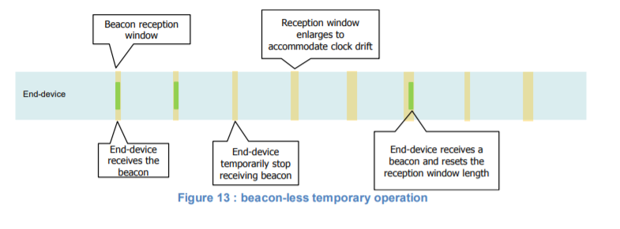

# Beacon acquisition and tracking(信标捕获与跟踪)

    Before switching from Class A to Class B,
    the end-device MUST first receive one of the network beacons to align
    his internal timing reference with the network.
    在从A类切换到B类之前，终端设备必须首先接收其中一个网络信标，
    以使其内部定时参考与网络对齐。

    Once in Class B, the end-device MUST periodically search and receive a network beacon to
    cancel any drift of its internal clock time base, relative to the network timing.
    一旦进入B类，终端设备必须周期性地搜索和接收网络信标，
    以消除其内部时钟时基相对于网络定时的任何漂移。

    A Class B device may be temporarily unable to receive beacons (out of range from the network
    gateways, presence of interference, ..). In this event, the end-device has to gradually widen
    its beacon and ping slots reception windows to take into account a possible drift of its internal
    clock.
    B类设备可能暂时无法接收信标（超出网络网关的范围、存在干扰等）。
    在这种情况下，终端设备必须逐渐扩大其信标和ping插槽接收窗口，以考虑其内部时钟的可能漂移。

    Note: For example, a device which internal clock is defined with a +/-
    10ppm precision may drift by +/-1.3mSec every beacon period.
    注：例如，内部时钟定义精度为+/-10ppm的设备可能会在每个信标周期内漂移+/-1.3毫秒。

## 12.1 Minimal beacon-less operation time(最少无信标操作时间)

    In the event of beacon loss, a device SHALL be capable of maintaining Class B operation for
    2 hours (120 minutes) after it received the last beacon. This temporary Class B operation
    without beacon is called “beacon-less” operation. It relies on the end-device’s own clock to
    keep timing.
    在信标丢失的情况下，设备应能够在接收到最后一个信标后保持2小时（120分钟）的B级运行。
    这种没有信标的临时B类操作称为“无信标”操作。它依靠终端设备自己的时钟来计时。

    During beacon-less operation, Class B unicast, multicast and beacon reception slots MUST
    all be progressively expanded to accommodate the end-device’s possible clock drift.

## 12.2 Extension of beacon-less operation upon reception(接收时无信标操作的扩展)

    During this 120 minutes time interval the reception of any beacon directed to the end-device,
    should extend the Class B beacon-less operation further by another 120 minutes as it allows
    to correct any timing drift and reset the receive slots duration.
    在这120分钟的时间间隔内，任何指向终端设备的信标的接收应将无B类信标操作再延长120分钟，
    因为它允许校正任何定时漂移并重置接收时隙持续时间。

    Note: Device should also use classB pingSlots downlinks to
    resynchronize its’ internal clock.
    注：设备还应使用B类pingSlots下行链路重新同步其内部时钟。

## 12.3 Minimizing timing drift

    The end-devices MAY use the beacon’s (when available) precise periodicity to calibrate their
    internal clock and therefore reduce the initial clock frequency imprecision. As the timing
    oscillator’s exhibit a predictable temperature frequency shift, the use of a temperature sensor
    could enable further minimization of the timing drift.
    终端设备可以使用信标（如果可用）的精确周期性来校准其内部时钟，
    从而降低初始时钟频率的不精确性。
    由于定时振荡器表现出可预测的温度频移，使用温度传感器可使定时漂移进一步最小化。
