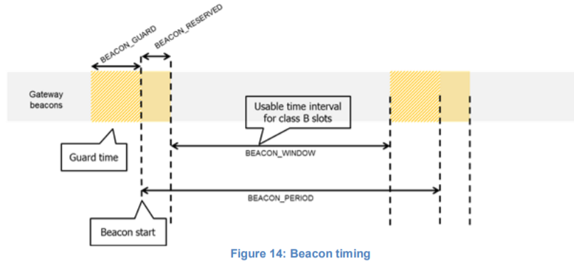
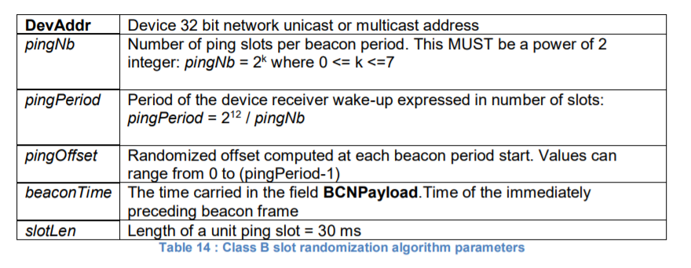

# Class B Downlink slot timing

## 13.1 Definitions

    To operate successfully in Class B the end-device MUST open reception slots at precise
    instants relative to the infrastructure beacon. This section defines the required timing.
    要在B类中成功运行，终端设备必须在相对于基础设施信标的精确时刻打开接收插槽。
    本节定义了所需的时间。

    The interval between the start of two successive beacons is called the beacon period. The
    beacon frame transmission is aligned with the beginning of the BEACON_RESERVED
    interval. Each beacon is preceded by a guard time interval where no ping slot can be placed.
    The length of the guard interval corresponds to the time on air of the longest allowed frame.
    This is to insure that a Class B downlink initiated during a ping slot just before the guard time
    will always have time to complete without colliding with the beacon transmission. The usable
    time interval for ping slot therefore spans from the end of the beacon reserved time interval to
    the beginning of the next beacon guard interval.
    两个连续信标开始之间的间隔称为信标周期。信标帧传输与信标间隔的开始对齐。
    每个信标前面都有一个保护时间间隔，在该时间间隔中不能放置ping时隙。
    保护间隔的长度对应于允许的最长帧的广播时间。
    这是为了确保在保护时间之前的ping时隙期间发起的B类下行链路总是有时间完成而不会与信标传输发生冲突。
    因此，ping时隙的可用时间间隔从信标保留时间间隔的结束到下一个信标保护间隔的开始。

    |   Beacon_period   |   128s   |
    |------------------------------|
    |  Beacon_reserved  |  2.120s  |
    |------------------------------|
    |    Beacon_guard   |  3.000s  |
    |------------------------------|
    |   Beacon_window   | 122.880s |

    The beacon frame time on air is actually much shorter than the beacon reserved time interval
    to allow appending network management broadcast frames in the future.
    空中信标帧时间实际上比信标预留时间间隔短得多，以便在将来附加网络管理广播帧。

    The beacon window interval is divided into 2**12 = 4096 ping slots of 30 ms each numbered from
    0 to 4095.
    信标窗口间隔被划分为2**12 = 4096个30ms的ping时隙，每个时隙的编号从0到4095。

    An end-device using the slot number N MUST have its receiver on Ton seconds after the start
    of the beacon where:
    使用时隙号N的终端设备必须在信标开始后的Ton秒内使其接收器开启，其中：
    Ton = beacon_reserved + N * 30 ms

    N is called the slot index.
    N称为时隙索引。

    The latest ping slot starts at beacon_reserved + 4095 * 30 ms = 124 970 ms after the beacon
    start or 3030 ms before the beginning of the next beacon.
    最新的ping时隙在beacon_reserved + 4095 * 30ms = 124970ms在信标开始后或在下一个信标开始前3030ms开始。

## 13.2 Slot randomization

    To avoid systematic collisions or over-hearing problems the slot index is randomized and
    changed at every beacon period.
    为了避免系统碰撞或过度听力问题，时隙索引是随机的，并且在每个信标周期都会改变。

    The following parameters are used:
    使用以下参数：

    At each beacon period the end-device and the server compute a new pseudo-random offset
    to align the reception slots. An AES encryption with a fixed key of all zeros is used to
    randomize:
    在每个信标周期，终端设备和服务器计算新的伪随机偏移以对准接收时隙。
    使用具有全零固定密钥的AES加密来随机化：

    Key = 16 x 0x00
    Rand = aes128_encrypt(Key, beaconTime | DevAddr | pad16)
    pingOffset = (Rand[0] + Rand[1]x 256) modulo pingPeriod

    The slots used for this beacon period will be:
    用于此信标周期的Slots将是：
    pingOffset + N x pingPeriod with N=[0:pingNb-1]

    The node therefore opens receive slots starting at:
    因此，节点从以下位置开始打开接收插槽：

    | First slot | Beacon_reserved + pingOffset x slotLen                    |
    |------------------------------------------------------------------------|
    |   Slot2    | Beacon_reserved + (pingOffset + pingPeriod) x slotLen     |
    |------------------------------------------------------------------------|
    |   Slot3    | Beacon_reserved + (pingOffset + 2 x pingPeriod) x slotLen |
    |------------------------------------------------------------------------|
    |   ...      | ...                                                       |

    If the end-device serves simultaneously a unicast and one or more multicast slots this
    computation is performed multiple times at the beginning of a new beacon period. Once for
    the unicast address (the node network address) and once for each multicast group address.
    如果终端设备同时服务于单播和一个或多个多播时隙，则在新信标周期的开始处多次执行该计算。
    一次用于单播地址（节点网络地址），一次用于每个多播组地址。

    In the case where a multicast ping slot and a unicast ping slot collide and cannot be served
    by the end-device receiver then the end-device should preferentially listen to the multicast
    slot. If there is a collision between multicast reception slots the FPending bit of the previous
    multicast frame can be used to set a preference.
    在多播ping时隙和单播ping时隙冲突并且不能由终端设备接收器服务的情况下，
    终端设备应当优先侦听多播时隙。
    如果多播接收时隙之间存在冲突，则可以使用前一个多播帧的结束位来设置首选项。

    The randomization scheme prevents a systematic collision between unicast and multicast
    slots. If collisions happen during a beacon period then it is unlikely to occur again
    during the next beacon period.
    随机化方案防止了单播和多播时隙之间的系统性冲突。
    如果碰撞发生在信标周期内，则在下一信标周期内不太可能再次发生。
