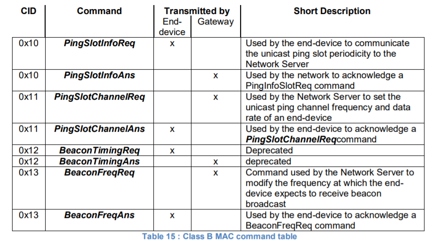
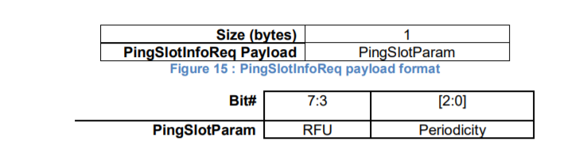
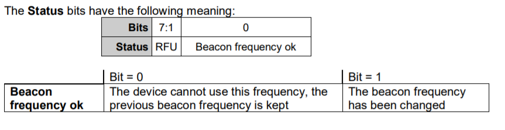
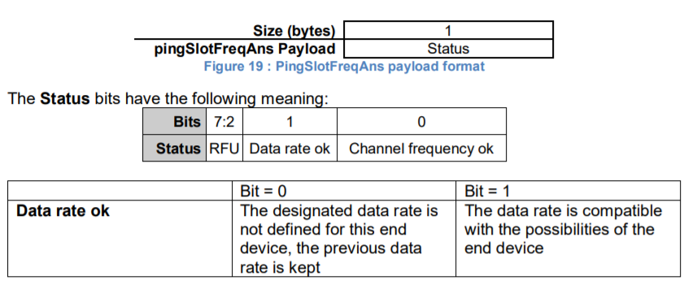

# ClassB MAC commands

    All commands described in the Class A specification SHALL be implemented in Class B
    devices. The Class B specification adds the following MAC commands.
    A类规范中描述的所有命令应在B类设备中实现。ClassB规范添加了以下MAC命令。

## 14.1 PingSlotInfoReq

    With the PingSlotInfoReq command an end-device informs the server of its unicast ping slot
    periodicity. This command may only be used to inform the server of the periodicity of a
    UNICAST ping slot. A multicast slot is entirely defined by the application and
    should not use this command.
    使用PingSlotInfoReq命令，终端设备通知服务器其单播ping时隙周期。
    此命令只能用于通知服务器单播ping时隙的周期性。多播时隙完全由应用程序定义，不应使用此命令。

    The Periodicity subfield is an unsigned 3 bits integer encoding the ping slot period currently
    used by the end-device using the following equation.
    周期子字段是一个无符号3位整数，使用以下等式编码终端设备当前使用的ping时隙周期。

    𝑝𝑖𝑛𝑔𝑁𝑏 = 2**(7−𝑃𝑒𝑟𝑖𝑜𝑑𝑖𝑐𝑖𝑡𝑦) 𝑎𝑛𝑑 𝑝𝑖𝑛𝑔𝑃𝑒𝑟𝑖𝑜𝑑 = 2**(5+𝑃𝑒𝑟𝑖𝑜𝑑𝑖𝑐𝑖𝑡y)

    The actual ping slot periodicity will be equal to 0.96 × 2**𝑃𝑒𝑟𝑖𝑜𝑑𝑖𝑐𝑖𝑡𝑦 in seconds
    实际ping时隙周期将等于0.96×2**Periodicity秒

    Periodicity = 0 means that the end-device opens a ping slot approximately every
    second during the beacon_window interval.
    周期性=0表示在信标窗口间隔期间，终端设备大约每秒打开一个ping插槽。

    Periodicity = 7, every 128 seconds which is the maximum ping period supported by
    the LoRaWAN Class B specification.
    周期=7，每128秒一次，这是LoRaWAN B类规范支持的最大ping周期。

    To change its ping slot periodicity a device SHALL first revert to Class A , send the new
    periodicity through a PingSlotInfoReq command and get an acknowledge from the server
    through a PingSlotInfoAns . It MAY then switch back to Class B with the new periodicity.
    要更改其ping插槽周期，设备应首先恢复为A类，通过PingSlotInfoReq命令发送新的周期，
    并通过PingSlotInfoAns从服务器获得确认。然后，它可能以新的周期性切换回B类。

    This command MAY be concatenated with any other MAC command in the FHDRFOpt field
    as described in the Class A specification frame format.
    该命令可以与FHDRFOpt字段中的任何其他MAC命令串联，如A类规范帧格式中所描述的。

## 14.2 BeaconFreqReq

    This command is sent by the server to the end-device to modify the frequency on which this
    end-device expects the beacon.
    此命令由服务器发送到终端设备，以修改此终端设备期望信标的频率。

    |        Octets         |     3     |
    |-----------------------------------|
    | BeaconFreqReq payload | Frequency |

    The Frequency coding is identical to the NewChannelReq MAC command defined in the Class A.
    频率编码与A类中定义的NewChannelReq MAC命令相同。

    Frequency is a 24bits unsigned integer. The actual beacon channel frequency in Hz is 100 x
    frequ. This allows defining the beacon channel anywhere between 100 MHz to 1.67 GHz by
    100 Hz step. The end-device has to check that the frequency is actually allowed by its radio
    hardware and return an error otherwise.
    频率是24位无符号整数。以Hz为单位的实际信标信道频率为100 x frequ。
    这允许以100Hz的步长定义100MHz到1.67GHz之间的任何信标信道。
    终端设备必须检查其无线电硬件是否允许该频率，否则返回错误。

    A valid non-zero Frequency will force the device to listen to the beacon on a fixed frequency
    channel even if the default behavior specifies a frequency hopping beacon (i.e US ISM band).
    有效的非零频率将强制设备在固定频率信道上收听信标，即使默认行为指定了跳频信标（即美国ISM频段）。

    A value of 0 instructs the end-device to use the default beacon frequency plan as defined in
    the “Beacon physical layer” section. Where applicable the device resumes frequency hopping
    beacon search.
    值为0指示终端设备使用“信标物理层”部分中定义的默认信标频率计划。
    在适用的情况下，设备恢复跳频信标搜索。

    Upon reception of this command the end-device answers with a BeaconFreqAns message.
    The MAC payload of this message contains the following information:
    在接收到该命令后，终端设备用BeaconFreqAns消息应答。此消息的MAC负载包含以下信息：

    |      Size(bytes)      |    1    |
    |---------------------------------|
    | BeaconFreqAns Payload | Status  |

## 14.3 PingSlotChannelReq

    This command is sent by the server to the end-device to modify the frequency and/or the data
    rate on which the end-device expects the downlink pings.
    该命令由服务器发送到终端设备，以修改终端设备期望下行链路ping的频率和/或数据速率。

    This command can only be sent in a class A receive window (following an uplink). The
    command SHALL NOT be sent in a class B ping-slot. If the device receives it inside a class B
    ping-slot, the MAC command SHALL NOT be processed. Once the NS has sent the first
    PingSlotChannelReq command, it SHOULD resend it until it receives a PingSlotChannelAns
    from the device. It MUST NOT attempt to use a class B ping slot until it receives the
    PingSlotChannelAns.
    此命令只能在A类接收窗口中发送（在上行链路之后）。
    命令不能在B类ping时隙中发送。如果设备在B类ping插槽中接收到它，则不应处理MAC命令。
    一旦NS发送了第一个PingSlotChannelReq命令，它应该重新发送它，
    直到它从设备接收到PingSlotChannelAns。
    直到在接收到pingslotchannelAns，它不能尝试使用classB ping插槽。

    |          Octets            |     3     | 1  |
    |---------------------------------------------|
    | PingSlotChannelReq Payload | Frequency | DR |

    The Frequency coding is identical to the NewChannelReq MAC command defined in the
    Class A.
    频率编码与A类中定义的NewChannelReq MAC命令相同。

    Frequency is a 24bits unsigned integer. The actual ping channel frequency in Hz is 100 x
    frequ. This allows defining the ping channel anywhere between 100MHz to 1.67GHz by 100Hz
    step. The end-device has to check that the frequency is actually allowed by its radio hardware
    and return an error otherwise.
    频率是24位无符号整数。实际ping通道频率（Hz）为100 x frequ。
    这允许通过100Hz步进定义100MHz到1.67GHz之间的ping通道。
    终端设备必须检查其无线电硬件是否允许该频率，否则返回错误。

    A value of 0 instructs the end-device to use the default frequency plan. Where applicable the
    device resumes frequency hopping beacon search.
    值0指示终端设备使用默认频率计划。在适用的情况下，设备恢复跳频信标搜索。

    The DR byte contains the following fields:
    DR字节包含以下字段：

    | Bits | [7:4] |   [3:0]   |
    |--------------------------|
    |  DR  |  RFU  | Data Rate |

    The “data rate” subfield is the index of the Data Rate used for the ping-slot downlinks. The
    relationship between the index and the physical data rate is defined in [PHY] for each region.
    “数据速率”子字段是用于ping时隙下行链路的数据速率的索引。
    索引和物理数据速率之间的关系在每个区域的[PHY]中定义。

    Upon reception of this command the end-device answers with a PingSlotFreqAns message.
    The MAC payload of this message contains the following information:
    在接收到这个命令后，终端设备用PingSlotFreqAns消息进行应答。此消息的MAC负载包含以下信息：

    If either of those 2 bits equals 0, the command did not succeed and the ping-slot parameters
    have not been modified.
    如果这2位中的任何一位等于0，则该命令未成功，并且ping插槽参数未被修改。

## 14.4 BeaconTimingReq & BeaconTimingAns

    These MAC commands are deprecated in the LoRaWAN1.0.3 version. The device may use
    DeviceTimeReq&Ans commands as a substitute.
    这些MAC命令在LoRaWAN1.0.3版本中已被弃用。设备可以使用DeviceTimeReq&Ans命令作为替代。
