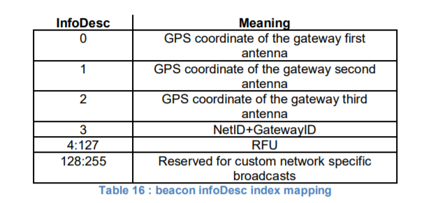

# Beaconing (Class B option)

## 15.1 Beacon physical layer

    Besides relaying messages between end-devices and Network Servers, gateways MAY
    participate in providing a time-synchronization mechanisms by sending beacons at regular
    fixed intervals. All beacons are transmitted in radio packet implicit mode, that is,
    without a LoRa physical header and with no CRC being appended by the radio.
    除了在终端设备和网络服务器之间转发消息外，网关还可以通过定期发送信标来参与提供时间同步机制。
    所有信标都以无线包隐式方式传输，即不带LoRa物理报头，也不附加CRC。

    | PHY | Preamble | BCNPayload |

    The beacon Preamble SHALL begin with (a longer than default) 10 unmodulated symbols.
    This allows end-devices to implement a low power duty-cycled beacon search.
    信标前导应以10个未调制符号开始（比默认值长）。这允许终端设备实现低功率占空比信标搜索。

    The beacon frame length is tightly coupled to the operation of the radio Physical layer.
    Therefore the actual frame length and content might change from one region implementation
    to another. The beacon content, modulation parameters and frequencies to use are specified
    in [PHY] for each region.
    信标帧长度与无线电物理层的操作紧密耦合。
    因此，实际的帧长度和内容可能会从一个区域实现更改为另一个区域实现。
    要使用的信标内容、调制参数和频率在PHY中为每个区域指定。

## 15.2 Beacon frame content

    The beacon payload BCNPayload consists of a network common part and an OPTIONAL
    gateway-specific part.
    信标有效负载BCNPayload由网络公共部分和可选网关特定部分组成。

    | Size(bytes) | 2 to 5 |   4    |  2   |    7       | 0 to 3 |  2  |
    |------------------------------------------------------------------|
    | BCNPayload  |  RFU   |  Time  | CRC  | GwSpecific |  RFU   | CRC |
    |------------------------------------------------------------------|
    |             | Compulsory common part |       Optional part       |

    The common part contains an RFU field equal to 0, a timestamp Time in seconds since
    January 6, 1980 00:00:00 UTC (start of the GPS epoch) modulo 2^32. The integrity of the
    beacon’s network common part is protected by a 16 bits CRC. The CRC-16 is computed on
    the RFU+Time fields as defined in the IEEE 802.15.4-2003 section 7.2.1.8. This CRC uses
    the following polynomial P(x) = x**16 + x**12 + x**5 + x**0.
    The CRC is calculated on the bytes in the order they are sent over-the-air.
    公共区域中RFU都为0, 时间戳为从1980年1月起使用秒表示。
    信标网络公共部分的完整性由16位CRC保护。
    CRC-16根据IEEE 802.15.4-2003第7.2.1.8节中定义的RFU+时间字段计算。
    此CRC使用多项式P（x）= x**16 + x**12 + x**5 + x**0。CRC是按字节在空中发送的顺序计算的。

    For example: This is a valid EU868 beacon frame:
    00 00 | 00 00 02 CC | A2 7E | 00 | 01 20 00 | 00 81 03 | DE 55

    Bytes are transmitted left to right. The first CRC is calculated on [00 00 00 00 02 CC].
    The corresponding field values are:
    字节从左到右传输。第一个CRC根据[00 00 02 CC]计算。相应的字段值为：

    |   Field   | RFU  |   Time   | CRC  | InfoDesc |  lat   |  long  | CRC  |
    |------------------------------------------------------------------------|
    | Value Hex | 0000 | CC020000 | 7EA2 |    0     | 002001 | 038100 | 55DE |

    The optional gateway specific part provides additional information regarding the gateway
    sending a beacon and therefore may differ for each gateway. The RFU field when applicable
    (region specific) should be equal to 0. The optional part is protected by a CRC-16 computed
    on the GwSpecific+RFU fields. The CRC-16 definition is the same as for the mandatory part.
    可选网关特定部分提供关于发送信标的网关的附加信息，因此对于每个网关可能不同。
    RFU字段（如果适用）（特定于区域）应等于0。
    可选部件受基于GwSpecific + RFU字段计算的CRC-16保护。CRC-16的定义与强制性部分相同。

    For example: This is a valid US900 beacon:

    |   Field   |   RFU  |   Time   | CRC  | InfoDesc |  lat   |  long  | RFU | CRC  |
    |--------------------------------------------------------------------------------|
    | Value Hex | 000000 | CC020000 | 7EA2 |    00    | 002001 | 038100 | 00  | D450 |

    Over the air the bytes are sent in the following order:
        00 00 00 | 00 00 02 CC | A2 7E | 00 | 01 20 00 | 00 81 03 |00 | 50 D4

    Listening and synchronizing to the network common part is sufficient to operate a stationary
    end-device in Class B mode. A mobile end-device MAY also demodulate the gateway specific
    part of the beacon to be able to signal to the Network Server whenever he is moving from one
    cell to another.
    监听和同步到网络公共部分足以在B类模式下操作固定终端设备。
    移动终端设备还可以解调信标的网关特定部分，
    以便在信标从一个小区移动到另一个小区时能够向网络服务器发送信号。

    Note: As mentioned before, all gateways participating in the beaconing
    process send their beacon simultaneously so that for network common
    part there are no visible on-air collisions for a listening end-device even
    if the end-device simultaneously receives beacons from several
    gateways. Not all gateways are required to participate in the beaconing
    process. The participation of a gateway to a given beacon may be
    randomized. With respect to the gateway specific part, collision occurs
    but an end-device within the proximity of more than one gateway will still
    be able to decode the strongest beacon with high probability.
    注：如前所述，参与信标过程的所有网关都同时发送信标，
    以便对于网络公共部分，即使终端设备同时从多个网关接收信标，
    侦听终端设备也不会出现可见的空中冲突。并非所有的网关都需要参与信标过程。
    到给定信标的网关的参与可以是随机的。
    对于网关特定部分，发生冲突，但是在多个网关附近的终端设备仍然能够高概率地解码最强信标。

## 15.3 Beacon GwSpecific field format

    The content of the GwSpecific field is as follow:
    | Size (bytes) |    1     |  6   |
    |--------------------------------|
    |  GwSpecific  | InfoDesc | Info |

    The information descriptor InfoDesc describes how the information field Info shall be
    interpreted.
    信息描述符InfoDesc描述如何解释信息字段信息。

    For a single omnidirectional antenna gateway the InfoDesc value is 0 when broadcasting
    GPS coordinates. For a site featuring 3 sectored antennas for example, the first antenna
    broadcasts the beacon with InfoDesc equals 0, the second antenna with InfoDesc field
    equals 1, etc.
    对于单个全向天线网关，在广播GPS坐标时，InfoDesc值为0。
    例如，对于具有3个扇区天线的站点，
    第一个天线用InfoDesc等于0广播信标，第二个天线用InfoDesc字段等于1，以此类推。

### 15.3.1 Gateway GPS coordinate:InfoDesc = 0, 1 or 2

    For InfoDesc = 0 ,1 or 2, the content of the Info field encodes the GPS coordinates of the
    antenna broadcasting the beacon.
    对于InfoDesc=0、1或2，Info字段的内容对广播信标的天线的GPS坐标进行编码。

    | Size (bytes) |  3  |  3  |
    |--------------------------|
    |     Info     | Lat | Lng |

    The latitude and longitude fields (Lat and Lng, respectively) encode the geographical location
    of the gateway as follows:
    纬度和经度字段（分别为Lat和Lng）将网关的地理位置编码如下：

    The north-south latitude is encoded using a two’s complement 24 bit word where -2**23
    corresponds to 90° south (the South Pole) and 2**23 - 1 corresponds to ~90° north
    (the North Pole). The Equator corresponds to 0.
    南北纬度使用2的补码24位字编码，其中-2**23对应于90°南（南极），
    2**23 - 1对应于~90°北（北极）。赤道对应于0。

    The east-west longitude is encoded using a two’s complement 24 bit word where - 2**23
    corresponds to 180° West and 2**23 - 1 corresponds to ~180° East. The Greenwich
    meridian corresponds to 0.
    东西经度使用2的补码24位字进行编码，其中-2**23对应于180°西，
    2**23-1对应于~180°东。格林威治子午线对应于0。

### 15.3.2 NetID + GatewayID

    For InfoDesc = 3, the content of the Info field encodes the network’s NetID plus a freely
    allocated gateway or cell identifier. The format of the Info field is:
    对于InfoDesc = 3，Info字段的内容对网络的NetID加上自由分配的网关或小区标识符进行编码。
    信息字段的格式为：

    | Size (bytes) |   3   |     3     |
    |----------------------------------|
    |     Info     | NetID | GatewayID |

### 15.4 Beaconing precise timing

    The beacon is sent every 128 seconds starting at January 6, 1980 00:00:00 UTC
    (start of the GPS epoch) plus TBeaconDelay. Therefore the beacon is sent at
    seconds after the GPS epoch.
    信标从1980年1月6日00:00:00 UTC（GPS历元的开始）加上TBeaconDelay开始每128秒发送一次。
    因此，信标在GPS历元后几秒发送。

    BT = k * 128 + TBeaconDelay

    whereby k is the smallest integer for which
    其中k是
        k * 128 > T

    whereby
        T = seconds since January 6, 1980 00:00:00 UTC (start of the GPS time).

    Note: T is GPS time and unlike Unix time, T is strictly monotonically
    increasing and is not influenced by leap seconds.
    注：T是GPS时间，与Unix时间不同，T严格单调递增，不受闰秒的影响。

    Whereby TBeaconDelay is 1.5 mSec +/- 1uSec delay.

    TBeaconDelay is meant to allow a slight transmission delay of the gateways required
    by the radio system to switch from receive to transmit mode.
    TBeaconDelay意味着允许无线系统从接收模式切换到发射模式所需的网关的轻微传输延迟。

    All end-devices ping slots use the beacon transmission start time as a timing reference,
    therefore the Network Server as to take TBeaconDelay into account when scheduling the
    class B downlinks.
    所有终端设备ping时隙使用信标传输开始时间作为定时基准，
    因此网络服务器在调度B类下行链路时考虑TBeaconDelay。

### 15.5 Network downlink route update requirements

    When the network attempts to communicate with an end-device using a Class B downlink slot,
    it transmits the downlink from the gateway which was closest to the end-device when the last
    uplink was received. Therefore the Network Server needs to keep track of the rough position
    of every Class B device.
    当网络尝试使用B类下行链路时隙与终端设备通信时，
    它从接收到最后一个上行链路时最接近终端设备的网关发射下行链路。
    因此，网络服务器需要跟踪每个B类设备的大致位置。

    Whenever a Class B device moves and changes cell, it needs to communicate with the
    Network Server in order to update its downlink route. This update can be performed simply
    by sending a “confirmed” or “unconfirmed” uplink, possibly without applicative payload.
    每当B类设备移动和改变小区时，它需要与网络服务器通信以更新其下行链路路由。
    此更新可以通过简单地发送“确认”或“未确认”上行链路来执行，可能没有应用的有效负载。

    The end-device has the choice between 2 basic strategies:
    终端设备可以选择两种基本策略：

    Systematic periodic uplink: simplest method that doesn’t require demodulation of the
    “gateway specific” field of the beacon. Only applicable to slowly moving or stationery
    end-devices. There are no requirements on those periodic uplinks.
    系统周期性上行链路：
    最简单的方法，不需要解调信标的“特定网关”字段。
    仅适用于缓慢移动或静态终端。对这些周期性上行链路没有任何要求。

    Uplink on cell change: The end-device demodulates the optional “gateway specific”
    field of the beacon, detects that the ID of the gateway broadcasting the beacon it
    demodulates has changed, and sends an uplink. In that case the device SHALL
    respect a pseudo random delay in the [0:120] seconds range between the beacon
    demodulation and the uplink transmission. This is required to insure that the uplinks
    of multiple Class B devices entering or leaving a cell during the same beacon period
    will not systematically occur at the same time immediately after the beacon broadcast.
    上行链路小区改变：
    终端设备解调信标的可选“网关特定”字段，
    检测广播其解调的信标的网关的ID已经改变，并发送上行链路。
    在这种情况下，设备应考虑信标解调和上行链路传输之间的[0:120]秒范围内的伪随机延迟。
    这是为了确保在同一信标周期内进入或离开小区的多个B类设备的上行链路
    不会在信标广播之后立即系统地同时发生。

    Failure to report cell change will result in Class B downlink being temporary not operational.
    The Network Server may have to wait for the next end-device uplink to transmit downlink
    traffic.
    不报告小区变化将导致B类下行链路暂时不工作。
    网络服务器可能必须等待下一个终端设备上行链路来传输下行链路业务。
