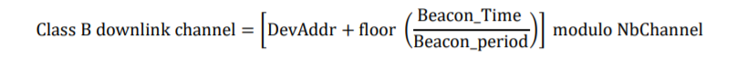

# Class B unicast & multicast downlink channel frequencies

    The class B downlink channel selection mechanism depends on the way
    the class B beacon is being broadcasted.
    B类下行链路信道选择机制取决于B类信标的广播方式。

## 16.1 Single channel beacon transmission

    In certain regions (ex EU868) the beacon is transmitted on a single channel.
    In that case, all unicast & multicastClass B downlinks use
    a single frequency channel defined by the “PingSlotChannelReq” MAC command.
    The default frequency is defined in [PHY].
    在某些区域（如EU868），信标在单个信道上传输。在这种情况下，
    所有单播和多播Class B下行链路使用由“PingSlotChannelReq”MAC命令定义的单个频率信道。
    默认频率在[PHY]中定义。

## 16.2 Frequency-hopping beacon transmission

    In certain regions (ex US902-928 or CN470-510)
    the class B beacon is transmitted following a frequency hopping pattern.
    在某些区域（例如US902-928或CN470-510），B类信标按照跳频模式传输。

    In that case, by default Class B downlinks use a channel
    which is a function of the Time field of the last beacon
    (see Beacon Frame content) and the DevAddr.
    在这种情况下，默认情况下，B类下行链路使用信道，
    该信道是最后一个信标（参见信标帧内容）和DevAddr的时间字段的函数。

    Whereby Beacon_Time is the 32 bit Time field of the current beacon period
    其中信标时间是当前信标周期的32位时间字段

    Beacon_period is the length of the beacon period (defined as 128sec in the
    specification)
    信标周期是信标周期的长度（在规范中定义为128秒）

    Floor designates rounding to the immediately lower integer value
    Floor将舍入指定为紧接着较低的整数值

    DevAddr is the 32 bits network address of the device
    DevAddr是设备的32位网络地址

    NbChannel is the number of channel over which the beacon is frequency hopping
    NbChannel是信标跳频的信道数

    Class B downlinks therefore hop across NbChannel channels (identical to the beacon
    transmission channels) in the ISM band and all Class B end-devices are equally spread
    amongst the NbChannel downlink channels.
    因此，B类下行链路在ISM频带中跨越NbChannel信道（与信标传输信道相同），
    并且所有B类终端设备在NbChannel下行链路信道中平均分布。

    If the “PingSlotChannelReq” command with a valid non-zero argument is used to set the
    Class B downlink frequency then all subsequent ping slots should be opened on this single
    frequency independently of the last beacon frequency.
    如果使用带有有效非零参数的“PingSlotChannelReq”命令来设置B类下行链路频率，
    则所有后续ping时隙都应在该单一频率上打开，而与最后一个信标频率无关。

    If the “PingSlotChannelReq” command with a zero argument is sent, the end-device should
    resume the default frequency plan, id Class B ping slots hoping across 8 channels.
    如果发送带有零参数的“PingSlotChannelReq”命令，
    终端设备应恢复默认频率计划，ID Class B ping slots，跨越8个通道。

    The underlying idea is to allow network operators to configure end-devices to use a single
    proprietary dedicated frequency band for the Class B downlinks if available, and to keep as
    much frequency diversity as possible when the ISM band is used.
    其基本思想是允许网络运营商将终端设备配置为使用B类下行链路的单个专有专用频带（如果可用），
    并在使用ISM频带时保持尽可能多的频率分集。
