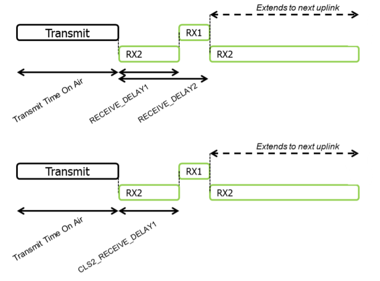

# Continuously listening end-device

    The end-devices implanting the Class C option are used for applications that have sufficient
    power available and thus do not need to minimize reception time.
    使用C类选项的终端设备用于具有足够的可用功率并且因此不需要最小化接收时间的应用。

    Class C end-devices cannot implement Class B option.
    C类终端设备无法实现B类选项。

    The Class C end-device will listen with RX2 windows parameters as often as possible. The
    end-device listens on RX2 when it is not either (a) sending or (b) receiving on RX1, according
    to Class A definition. To do so, it will open a short window on RX2 parameters between the
    end of the uplink transmission and the beginning of the RX1 reception window and it will
    switch to RX2 reception parameters as soon as the RX1 reception window is closed; the RX2
    reception window will remain open until the end-device has to send another message.
    C类终端设备将尽可能频繁地使用RX2窗口参数进行侦听。
    根据A类定义，终端设备在RX1上不（a）发送或（b）接收时监听RX2。
    为此，它将在上行链路传输结束和RX1接收窗口开始之间打开一个关于RX2参数的短窗口，
    并且一旦RX1接收窗口关闭，它将切换到RX2接收参数；
    RX2接收窗口将保持打开状态，直到终端设备必须发送另一条消息。

    Note: There is not specific message for a node to tell the server that it
    is a Class C node. It is up to the application on server side to know that
    it manages Class C nodes based on the contract passed during the join procedure.
    注意：节点没有特定的消息告诉服务器它是C类节点。
    服务器端的应用程序应该知道，它根据连接过程中传递的约定来管理C类节点。

## 17.1 Second receive window duration for Class C

    Class C devices implement the same two receive windows as Class A devices, but they do
    not close RX2 window until they need to send again. Therefore they may receive a downlink
    in the RX2 window at nearly any time, including downlinks sent for the purpose of MAC
    command or ACK transmission. A short listening window on RX2 frequency and data rate is
    also opened between the end of the transmission and the beginning of the RX1 receive window.
    C类设备实现与A类设备相同的两个接收窗口，但在需要再次发送之前，它们不会关闭RX2窗口。
    因此，它们可以在几乎任何时间在RX2窗口中接收下行链路，
    包括为了MAC命令或ACK传输而发送的下行链路。
    在传输结束和RX1接收窗口的开始之间，也打开了关于RX2频率和数据速率的短监听窗口。

## 17.2 Class C Multicast downlinks(ClassC 多播下行链路)

    Similarly to Class B, Class C devices may receive multicast downlink frames. The multicast
    address and associated network session key and application session key must come from the
    application layer.
    类似于B类，C类设备可以接收多播下行链路帧。
    多播地址、关联的网络会话密钥和应用程序会话密钥必须来自应用层。

    Example:
    [RPD1] provides an application layer mechanism to setup a multicast group over-the-air.
    示例：[RPD1]提供了一个应用层机制，可以通过无线方式建立多播组。

    The same limitations apply for Class C multicast downlink frames:
    下行链路的限制同样适用于C类：

    They are not allowed to carry MAC commands, neither in the FOpt field, nor in the
    payload on port 0 because a multicast downlink does not have the same
    authentication robustness as a unicast frame.
    它们不被允许携带MAC命令，无论是在FOpt字段中，还是在端口0上的有效负载中，
    因为多播下行链路没有与单播帧相同的认证健壮性。

    The ACK and ADRACKReq bits MUST be zero. The MType field MUST carry the
    value for Unconfirmed Data Down.
    ACK和ADRACKReq位必须为零。MType字段必须向下携带未确认数据的值。

    The FPending bit indicates there is more multicast data to be sent. Given that
    a Class C device keeps its receiver active most of the time,
    the FPending bit does not trigger any specific behavior of the end-device.
    FPending位表示有更多的多播数据要发送。
    假设C类设备在大多数时间内保持其接收器处于活动状态，
    则FPending位不会触发终端设备的任何特定行为。
