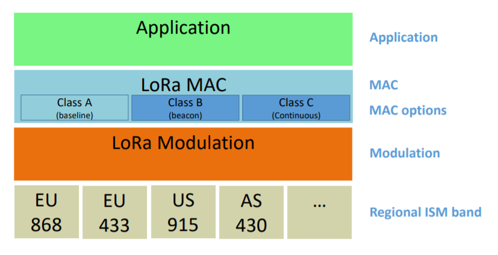

# Introduction on LoRaWAN options

    LoRa™ is a wireless modulation for long-range low-power low-data-rate applications developed by Semtech.
    Devices implementing more than Class A are generally named “higher Class end-devices” in this document.
    LoRa是由Semtech开发的用于远程低功耗低数据速率应用的无线调制。在本文档中，实现A级以上的设备通常称为“高级终端设备”。

## LoRaWAN Classes

    A LoRa network distinguishes between a basic LoRaWAN (named Class A) and optional features (Class B, Class C …):
    LoRa网络区分基本LoRaWAN（命名为A类）和可选功能（B类、C类…）：

    Bi-directional end-devices (Class A): End-devices of Class A allow for bi-directional
    communications whereby each end-device’s uplink transmission is followed by two
    short downlink receive windows. The transmission slot scheduled by the end-device is
    based on its own communication needs with a small variation based on a random time
    basis (ALOHA-type of protocol). This Class A operation is the lowest power end-device
    system for applications that only require downlink communication from the server
    shortly after the end-device has sent an uplink transmission. Downlink communications
    from the server at any other time will have to wait until the next scheduled uplink.
    双向终端设备（A类）：A类终端设备允许双向通信，其中每个终端设备的上行链路传输之后是两个短的下行链路接收窗口。
    终端设备调度的传输时隙基于其自身的通信需求，在随机时间基础上有小的变化（ALOHA协议类型）。
    对于只需要在终端设备发送了上行链路传输后不久从服务器进行下行链路通信的应用，这种A类操作是最低功率的终端设备系统。
    来自服务器的下行链路通信在任何其他时间都必须等到下一个预定的上行链路。

    Bi-directional end-devices with scheduled receive slots (Class B): End-devices of
    Class B allow for more receive slots. In addition to the Class A random receive
    windows, Class B devices open extra receive windows at scheduled times. In order for
    the End-device to open it receive window at the scheduled time it receives a time
    synchronized Beacon from the gateway. This allows the server to know when the end device is listening.
    具有预定接收时隙的双向终端设备（B类）：B类终端设备允许更多的接收时隙。除了A类随机接收窗口外，
    B类设备在预定时间打开额外的接收窗口。为了使终端设备在预定时间打开接收窗口，它从网关接收时间同步信标。
    这允许服务器知道终端设备何时在监听。

    Bi-directional end-devices with maximal receive slots (Class C): End-devices of
    Class C have nearly continuously open receive windows, only closed when
    transmitting. Class C end-device will use more power to operate than Class A or Class B
    but they offer the lowest latency for server to end-device communication.
    具有最大接收时隙的双向终端设备（C类）：C类终端设备几乎连续打开接收窗口，仅在传输时关闭。
    C类终端设备比A类或B类终端设备使用更多的功率来操作，但它们为服务器到端设备通信提供了最低的延迟。

## Specification scope(规范范围)

    This LoRaWAN specification describes the additional functions differentiating an end-device
    higher Class from one of Class A. A higher Class end-device SHALL also implement all the
    functionality described in the LoRaWAN Class A specification.
    本LoRaWAN规范描述了区别高级终端设备和A级终端设备的附加功能。
    高级终端设备还应实现LoRaWAN A级规范中描述的所有功能。

    NOTE: Physical message format, MAC message format, and other parts of this specification
    that are common to both end-devices of Class A and higher Classes are described only
    in the LoRaWAN Class A specification to avoid redundancy.
    注：物理消息格式、MAC消息格式和本规范中对A类和更高级别的终端设备通用的其他部分仅在LoRaWAN A级规范中描述，以避免冗余。
