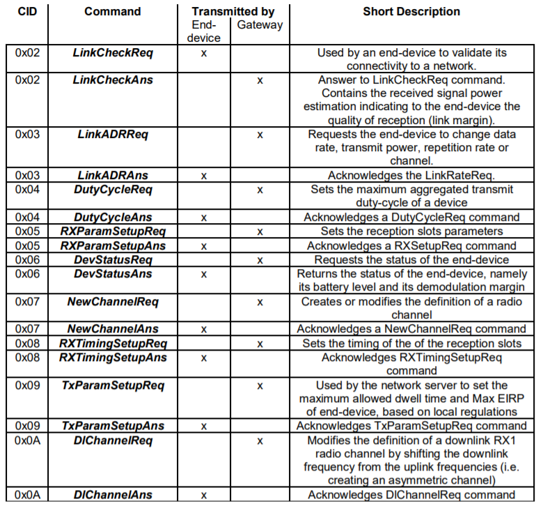
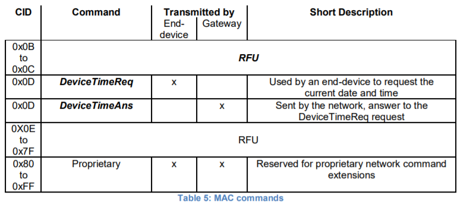
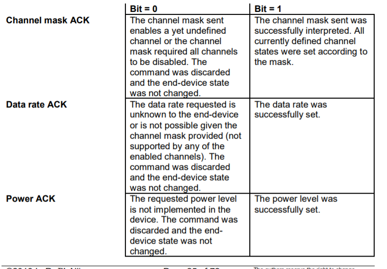
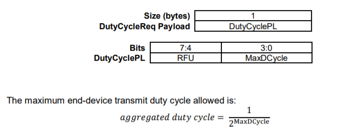
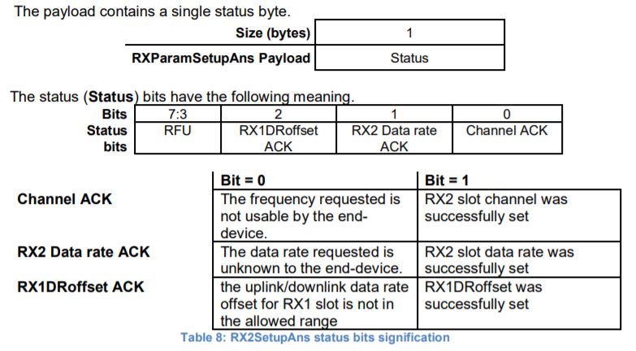
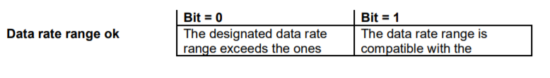
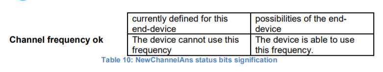

# MAC Commands

    For network administration, a set of MAC commands can be exchanged exclusively between
    the network server and the MAC layer on an end-device. MAC layer commands are never
    visible to the application or the application server or the application running on the end-device.
    对于网络管理，一组MAC命令可以在网络服务器和终端设备上的MAC层之间独占地交换。
    MAC层命令对应用程序、应用服务器或运行在终端设备上的应用程序永远不可见。

    A single data frame can contain any sequence of MAC commands, either piggybacked in the
    FOpts field or, when sent as a separate data frame, in the FRMPayload field with the FPort
    field being set to 0. Piggybacked MAC commands are always sent without encryption and
    MUST NOT exceed 15 octets. MAC commands sent as FRMPayload are always encrypted
    and MUST NOT exceed the maximum FRMPayload length.
    一个单独的数据帧可以包含任何MAC命令序列，可以是FOpts字段中的命令，
    也可以是作为单独的数据帧发送到FRMPayload字段中，FPort字段设置为0。
    附带的MAC命令总是在没有加密的情况下发送，并且不能超过15个八位字节。
    作为FRMPayload发送的MAC命令始终是加密的，并且不能超过FRMPayload的最大长度。

    Note: MAC commands whose content shall not be disclosed to an
    eavesdropper must be sent in the FRMPayload of a separate data message.
    注：MAC命令的内容不得透露给窃听者，必须在单独数据消息的FRMPayload中发送。

    A MAC command consists of a command identifier (CID) of 1 octet followed by a possibly
    empty command-specific sequence of octets.
    MAC命令由1个八位字节的命令标识符（CID）组成，后跟一个可能为空的特定于命令的八位字节序列。

    Note: The length of a MAC command is not explicitly given and must be
    implicitly known by the MAC implementation. Therefore unknown MAC
    commands cannot be skipped and the first unknown MAC command
    terminates the processing of the MAC command sequence. It is
    therefore advisable to order MAC commands according to the version
    of the LoRaWAN specification which has introduced a MAC command
    for the first time. This way all MAC commands up to the version of the
    LoRaWAN specification implemented can be processed even in the
    presence of MAC commands specified only in a version of the
    LoRaWAN specification newer than that implemented.
    注意：MAC命令的长度没有明确给出，必须由MAC实现隐式知道。
    因此未知MAC无法跳过命令和第一个未知的MAC命令终止对MAC命令序列的处理。
    因此，建议根据首次引入MAC命令的LoRaWAN规范版本来订购MAC命令。
    通过这种方式，即使存在仅在比所实施的LoRaWAN规范版本新的MAC命令指定的MAC命令存在的情况下，
    也可以处理到所实现的LoRaWAN规范版本之前的所有MAC命令。

    Note: Any values adjusted by the network server (e.g., RX2, new or adjusted channels definitions)
    remain only valid until the next join of the end-device.
    Therefore after each successful join procedure the end638 device uses the default parameters again
    and it is up to the network server to re-adjust the values again as needed.
    注：由网络服务器调整的任何值（例如，RX2、新的或调整的信道定义）仅在终端设备的下一个连接之前有效。
    因此，在每次成功的连接过程之后，终端设备都会再次使用默认参数，并由网络服务器根据需要重新调整这些值。

## 5.1 Link Check commands(链接检查命令) (LinkCheckReq, LinkCheckAns)

    With the LinkCheckReq command, an end-device MAY validate its connectivity with the
    network. The command has no payload.
    使用LinkCheckReq命令，终端设备可以验证其与网络的连接。该命令没有有效负载。

    When a LinkCheckReq is received by the network server via one or multiple gateways, it
    responds with a LinkCheckAns command.
    当网络服务器通过一个或多个网关接收到LinkCheckReq时，它用LinkCheckAns命令进行响应。

    |      Size(bytes)     |    1    |    1    |
    |------------------------------------------|
    | LinkCheckAns Payload |  Margin |  GwCnt  |

    The demodulation margin (Margin) is an 8-bit unsigned integer in the range of 0..254
    indicating the link margin in dB of the last successfully received LinkCheckReq command. A
    value of “0” means that the frame was received at the demodulation floor (0 dB or no margin)
    while a value of “20”, for example, means that the frame reached the gateway 20 dB above
    the demodulation floor. Value “255” is reserved.
    解调裕度（margin）是0..254范围内的8位无符号整数，表示最后成功接收到的LinkCheckReq命令的链路裕度（dB）。
    值“0”表示在解调层接收到帧（0db或无余量），而值“20”例如表示帧到达解调层上方的网关20db。保留值“255”。

    The gateway count (GwCnt) is the number of gateways that successfully received the last
    LinkCheckReq command.
    gateway count（GwCnt）是成功接收上一个LinkCheckReq命令的网关数。

## 5.2 Link ADR commands (LinkADRReq, LinkADRAns)

    With the LinkADRReq command, the network server requests an end-device to perform a rate adaptation.
    使用LinkADRReq命令，网络服务器请求终端设备执行速率自适应。

    |     Size(bytes)    |        1         |    2    |     1      |
    |--------------------------------------------------------------|
    | LinkADRReq Payload | DataRate_TXPower | ChMask  | Redundancy |

    |        Bits      |  [7:4]   |  [3:0]  |
    |---------------------------------------|
    | DataRate_TXPower | DataRate | TXPower |

    The requested data rate (DataRate) and TX output power (TXPower) are region-specific and
    are encoded as indicated in the “LoRaWAN regional physical layer specification” document.
    The TX output power indicated in the command is to be considered the maximum transmit
    power the device may operate at. An end-device will acknowledge as successful a command
    which specifies a higher transmit power than it is capable of using and should, in that case,
    operate at its maximum possible power. The channel mask (ChMask) encodes the channels
    usable for uplink access as follows with bit 0 corresponding to the LSB:
    请求的数据速率（DataRate）和TX输出功率（TXPower）是特定于区域的，
    并按照“LoRaWAN区域物理层规范”文档中的指示进行编码。
    命令中指示的TX输出功率被视为设备可能运行的最大发射功率。
    终端设备将确认命令成功，该命令指定了比其能够使用的更高的发射功率，
    在这种情况下，应以其最大可能的功率运行。
    信道掩码（ChMask）对可用于上行链路访问的信道进行如下编码，比特0对应于LSB：

    | Bits# | Usable channels |
    |-------------------------|
    |   0   |   Channel 1     |
    |   1   |   Channel 2     |
    |  ...  |   Channel ..    |
    |   15  |   Channel 16    |

    A bit in the ChMask field set to 1 means that the corresponding channel can be used for uplink
    transmissions if this channel allows the data rate currently used by the end-device. A bit set
    to 0 means the corresponding channels should be avoided.
    ChMask字段中的位设置为1意味着如果该信道允许终端设备当前使用的数据速率，
    则相应的信道可用于上行链路传输。位设为0表示应避免相应的通道。

    |       Bits      |  7  |   [6:4]    |  [3:0]  |
    |----------------------------------------------|
    | Redundancy bits | RFU | ChMaskCntl | NbTrans |

    In the Redundancy bits the NbTrans field is the number of transmissions for each uplink
    message. This applies only to “unconfirmed” uplink frames. The default value is 1
    corresponding to a single transmission of each frame. The valid range is [1:15]. If NbTrans==0
    is received the end-device should use the default value. This field can be used by the network
    manager to control the redundancy of the node uplinks to obtain a given Quality of Service.
    The end-device performs frequency hopping as usual between repeated transmissions, it
    does wait after each repetition until the receive windows have expired. . Whenever a downlink
    message is received during the RX1 slot window, it SHALL stop any further retransmission of
    the same uplink message. For class A devices, a reception in the RX2 slot has the same effect.
    在冗余位中，NbTrans字段是每个上行链路消息的传输次数。这只适用于“未确认”上行链路帧。
    默认值为1，对应于每个帧的单个传输。有效范围为[1:15]。如果接收到NbTrans==0，终端设备应使用默认值。
    该字段可由网络管理器用于控制节点上行链路的冗余，以获得给定的服务质量。
    终端设备像往常一样在重复传输之间执行跳频，每次重复之后它都会等待，直到接收窗口过期。
    每当在RX1时隙窗口期间接收到下行链路消息时，它应停止同一上行链路消息的任何进一步重传。
    对于A类设备，RX2插槽中的接收具有相同的效果。

    The channel mask control (ChMaskCntl) field controls the interpretation of the previously
    defined ChMask bit mask. It controls the block of 16 channels to which the ChMask applies.
    It can also be used to globally turn on or off all channels using specific modulation. This field
    usage is region specific and is defined in the “LoRaWAN regional physical layer specification”
    document.
    通道掩码控制（ChMaskCntl）字段控制先前定义的ChMask位掩码的解释。ChMask16的通道应用于哪个块。
    它还可以用于全局打开或关闭使用特定调制的所有信道。
    此字段的使用是特定于地区的，在“LoRaWAN区域物理层规范”文档中有定义。

    The network server MAY include multiple LinkAdrReq commands within a single downlink
    message. For the purpose of configuring the end-device channel mask, the end-device will
    process all contiguous LinkAdrReq messages, in the order present in the downlink message,
    as a single atomic block command. The end-device will accept or reject all Channel Mask
    controls in the contiguous block, and provide consistent Channel Mask ACK status indications
    for each command in the contiguous block in each LinkAdrAns message, reflecting the
    acceptance or rejection of this atomic channel mask setting. The device will only process the
    DataRate, TXPower and NbTrans from the last message in the contiguous block, as these
    settings govern the end-device global state for these values. The end-device will provide
    consistent ACK status in each LinkAdrAns message reflecting the acceptance or rejection of
    these final settings.
    网络服务器可以在单个下行链路消息中包括多个LinkAdrReq命令。
    为了配置终端设备信道掩码，终端设备将按照下行链路消息中的顺序，
    作为单个原子块命令来处理所有连续的LinkAdrReq消息。
    终端设备将接受或拒绝相邻块中的所有信道掩码控制，
    并在每个LinkAdrAns消息中为相邻块中的每个命令提供一致的信道掩码ACK状态指示，
    反映对该原子信道掩码设置的接受或拒绝。
    设备将只处理连续块中最后一条消息的DataRate、TXPower和NbTrans，因为这些设置控制这些值的终端设备全局状态。
    终端设备将在每个LinkAdrAns消息中提供一致的ACK状态，反映这些最终设置的接受或拒绝。

    The channel frequencies are region-specific and they are defined in Chapter 6. An end-device
    answers to a LinkADRReq with a LinkADRAns command.
    信道频率是特定于区域的，它们在第6章中定义。终端设备用LinkADRAns命令应答LinkADRReq。

    |     Size(bytes)    |    1    |
    |------------------------------|
    | LinkADRAns Payload | Status  |

    |     Bits    | [7:3] |     2     |       1       |        0         |
    |--------------------------------------------------------------------|
    | Status Bits |  RFU  | Power ACK | Data rate ACK | Channel mask ACK |

    The LinkADRAns Status bits have the following meaning:
    LinkADRAns状态位具有以下含义：

    If any of those three bits equals 0, the command did not succeed and the node has kept the
    previous state.
    如果这三个位中的任何一位ACK等于0，则该命令没有成功，节点仍保持先前的状态。

## 5.3 End-Device Transmit Duty Cycle (DutyCycleReq, DutyCycleAns)

    The DutyCycleReq command is used by the network coordinator to limit the maximum
    aggregated transmit duty cycle of an end-device. The aggregated transmit duty cycle
    corresponds to the transmit duty cycle over all sub-bands.
    网络协调器使用DutyCycleReq命令来限制终端设备的最大聚合传输占空比。
    总的发射占空比对应于所有子频带上的发射占空比。

    The valid range for MaxDutyCycle is [0 : 15]. A value of 0 corresponds to “no duty cycle
    limitation” except the one set by the regional regulation.
    MaxDutyCycle的有效范围是[0:15]。值0对应于“无工作循环限制”，但区域法规设置的值除外。

    An end-device answers to a DutyCycleReq with a DutyCycleAns command. The
    DutyCycleAns MAC reply does not contain any payload.
    终端设备用DutyCycleAns命令应答DutyCycleReq。DutyCycleAns MAC回复不包含任何有效负载。

## 5.4 Receive Windows Parameters (RXParamSetupReq, RXParamSetupAns)

    The RXParamSetupReq command allows a change to the frequency and the data rate set
    for the second receive window (RX2) following each uplink. The command also allows to
    program an offset between the uplink and the RX1 slot downlink data rates.
    RXParamSetupReq命令允许更改为每个上行链路之后的第二个接收窗口（RX2）设置的频率和数据速率。
    该命令还允许编程上行链路和RX1时隙下行链路数据速率之间的偏移。

    |       Size(bytes)       |     1      |     3     |
    |--------------------------------------------------|
    | RXParamSetupReq Payload | DLsettings | Frequency |

    |     Bits    |  7  |     6:4     |     3:0     |
    |-----------------------------------------------|
    | DLsettings  | RFU | RX1DRoffset | RX2DRoffset |

    The RX1DRoffset field sets the offset between the uplink data rate and the downlink data
    rate used to communicate with the end-device on the first reception slot (RX1). As a default
    this offset is 0. The offset is used to take into account maximum power density constraints
    for base stations in some regions and to balance the uplink and downlink radio link margins.
    RX1DRoffset字段设置用于在第一接收时隙（RX1）上与终端设备通信的上行链路数据速率和
    下行链路数据速率之间的偏移。默认情况下，此偏移量为0。
    偏移量用于考虑某些地区基站的最大功率密度约束，并平衡上行和下行无线链路余量。

    The data rate (RX2DataRate) field defines the data rate of a downlink using the second
    receive window following the same convention as the LinkADRReq command (0 means
    DR0/125kHz for example). The frequency (Frequency) field corresponds to the frequency of
    the channel used for the second receive window, whereby the frequency is coded following
    the convention defined in the NewChannelReq command.
    数据速率（RX2DataRate）字段使用第二个接收窗口定义下行链路的数据速率，
    该第二个接收窗口遵循与LinkADRReq命令相同的约定（例如0表示DR0/125kHz）。
    频率（frequency）字段对应于用于第二个接收窗口的信道的频率，
    其中频率按照NewChannelReq命令中定义的约定进行编码。

    The RXParamSetupAns command is used by the end-device to acknowledge the reception
    of RXParamSetupReq command. The RXParamSetupAns command should be added in
    the FOpt field of all uplinks until a class A downlink is received by the end-device. This
    guarantees that even in presence of uplink packet loss, the network is always aware of the
    downlink parameters used by the end-device.
    终端设备使用RXParamSetupAns命令来确认接收到RXParamSetupReq命令。
    RXParamSetupAns命令应添加到所有上行链路的FOpt字段中，直到终端设备接收到A类下行链路。
    这保证了即使在存在上行链路分组丢失的情况下，网络始终知道终端设备使用的下行链路参数。

    If either of the 3 bits is equal to 0, the command did not succeed and
    the previous parameters are kept.
    如果3位中的任何一位等于0，则命令没有成功，并且保留先前的参数。

## 5.5 End-Device Status (DevStatusReq, DevStatusAns)

    With the DevStatusReq command a network server may request status information from an
    end-device. The command has no payload. If a DevStatusReq is received by an end-device,
    it responds with a DevStatusAns command.
    使用DevStatusReq命令，网络服务器可以从终端设备请求状态信息。该命令没有有效负载。
    如果终端设备接收到DevStatusReq，它将用DevStatusAns命令响应。

    |      Size(bytes)     |       1       |      3       |
    |-----------------------------------------------------|
    | DevStatusAns Payload | Battery(电池) | Margin(空白) |

    The battery level (Battery) reported is encoded as follows:
    报告的电池电量（电池）编码如下：

    |  Battery  |                       Description                               |
    |-----------------------------------------------------------------------------|
    |     0     | The end-device is connected to an external power source.        |
    |           | 终端设备连接到外部电源。                                        |
    |-----------------------------------------------------------------------------|
    |  1..254   | The battery level, 1 being at minimum and 254 being at maximum. |
    |           | 电池电量，1为最低，254为最高。                                  |
    |-----------------------------------------------------------------------------|
    |    255    | The end-device was not able to measure the battery level.       |
    |           | 终端设备无法测量电池电量。                                      |

    The margin (Margin) is the demodulation signal-to-noise ratio in dB rounded to the nearest
    integer value for the last successfully received DevStatusReq command. It is a signed integer
    of 6 bits with a minimum value of -32 and a maximum value of 31.
    margin（margin）是解调信噪比，以dB为单位，
    四舍五入到上一个成功接收到的DevStatusReq命令的最近整数值。
    它是一个6位的有符号整数，最小值为-32，最大值为31。

    |  Bits  |  7:6  |   5:0  |
    |-------------------------|
    | Status |  RFU  | Margin |

## Creation/Modification of a Channel(NewChannelReq, NewChannelAns, DlChannelReq, DlChannelAns)

    The NewChannelReq command can be used to either modify the parameters of an existing
    bidirectional channel or to create a new one. The command sets the center frequency of the
    new channel and the range of uplink data rates usable on this channel:
    NewChannelReq命令可用于修改现有双向信道的参数或创建新的双向信道。
    该命令设置新信道的中心频率和该信道上可用的上行链路数据速率范围：

    |      Size(bytes)      |    1    |  3   |    1    |
    |--------------------------------------------------|
    | NewChannelReq Payload | ChIndex | Freq | DrRange |

    The channel index (ChIndex) is the index of the channel being created or modified. Depending
    on the region and frequency band used, the LoRaWAN specification imposes default channels
    which MUST be common to all devices and cannot be modified by the NewChannelReq
    command (cf. Chapter 6). If the number of default channels is N, the default channels go from
    0 to N-1, and the acceptable range for ChIndex is N to 15. A device MUST be able to handle
    at least 16 different channel definitions. In certain region the device may have to store more
    than 16 channel definitions.
    频道索引（ChIndex）是正在创建或修改的频道的索引。根据所使用的区域和频带，
    LoRaWAN规范规定了所有设备必须共用的默认信道，并且不能通过NewChannelReq命令进行修改（参见第6章）。
    如果默认通道数为N，则默认通道从0到N-1，ChIndex的可接受范围是N到15。
    一个设备必须能够处理至少16个不同的通道定义。在某些区域，设备可能必须存储16个以上的信道定义。

    The frequency (Freq) field is a 24 bits unsigned integer. The actual channel frequency in Hz
    is 100 x Freq whereby values representing frequencies below 100 MHz are reserved for future
    use. This allows setting the frequency of a channel anywhere between 100 MHz to 1.67 GHz
    in 100 Hz steps. A Freq value of 0 disables the channel. The end-device has to check that the
    frequency is actually allowed by its radio hardware and return an error otherwise.
    频率（Freq）字段是一个24位无符号整数。以赫兹为单位的实际信道频率是100 x Freq，
    因此代表低于100Mhz的频率的值被保留以备将来使用。
    这允许以100Hz的步长将信道频率设置在100MHz到1.67GHz之间的任何地方。
    频率值为0将禁用通道。终端设备必须检查其无线电硬件是否允许该频率，否则返回错误。

    The data-rate range (DrRange) field specifies the uplink data-rate range allowed for this
    channel. The field is split in two 4-bit indexes:
    数据速率范围（DrRange）字段指定此信道允许的上行数据速率范围。字段分为两个4位索引：

    |   Bits  |  7:4  |  3:0  |
    |-------------------------|
    | DrRange | MaxDR | MinDR |

    Following the convention defined in Section 5.2 the minimum data rate (MinDR) subfield
    designate the lowest uplink data rate allowed on this channel. For example 0 designates DR0/125 kHz.
    Similarly, the maximum data rate (MaxDR) designates the highest uplink data rate.
    For example, DrRange = 0x77 means that only 50 kbps GFSK is allowed on a channel and
    DrRange = 0x50 means that DR0 / 125 kHz to DR5 / 125 kHz are supported.
    根据第5.2节中定义的约定，最小数据速率（MinDR）子字段指定该信道上允许的最低上行链路数据速率。
    例如0表示DR0/125 kHz。类似地，最大数据速率（MaxDR）指定最高上行链路数据速率。
    例如，DrRange=0x77表示一个信道上只允许50kbps的GFSK，DrRange=0x50表示支持DR0/125khz到DR5/125khz。

    The newly defined or modified channel is enabled and can immediately be used for
    communication. The RX1 downlink frequency is set equal to the uplink frequency.
    新定义或修改的通道被启用，可以立即用于通信。下行频率RX1等于上行频率。

    The end-device acknowledges the reception of a NewChannelReq by sending back a
    NewChannelAns command. The payload of this message contains the following information:
    终端设备通过发回NewChannelAns命令来确认NewChannelReq的接收。此消息的有效负载包含以下信息：

    |      Size(bytes)      |    1   |
    |--------------------------------|
    | NewChannelAns Payload | Status |

    The status (Status) bits have the following meaning:
    状态（状态）位具有以下含义：

    |  Bits  |  7:2  |        0           |         1            |
    |------------------------------------------------------------|
    | Status |  RFU  | Data rate range ok | Channel frequency ok |

    If either of those 2 bits equals 0, the command did not succeed and the new channel has not
    been created.
    如果这2位中的任何一位等于0，则命令没有成功，并且新通道尚未创建。

    The DlChannelReq command allows the network to associate a different downlink frequency
    to the RX1 slot. This command is applicable for all the physical layer specifications supporting
    the NewChannelReq command (for example EU and China physical layers, but not for US or
    Australia). In regions where that command is not defined, the device SHALL silently drop it.
    DlChannelReq命令允许网络将不同的下行链路频率与RX1插槽相关联。
    此命令适用于支持NewChannelReq命令的所有物理层规范（例如欧盟和中国物理层，但不适用于美国或澳大利亚）。
    在未定义该命令的区域，设备应静默放弃该命令。
