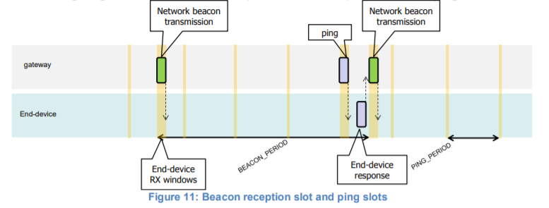

# Principle of synchronous network initiated downlink(Class-B option)

    Principle of synchronous network initiated downlink
    同步网络原理启动下行链路

    For a network to support end-devices of Class B, all gateways MAY synchronously broadcast
    beacon providing a timing reference to the end-devices.
    Based on this timing reference the end-devices can periodically open receive windows,
    hereafter called “ping slots”,
    which can be used by the network infrastructure to initiate a downlink communication.
    A network initiated downlink using one of these ping slots is called a “ping”.
    The gateway chosen to initiate this downlink communication is selected by the Network Server.
    For this reason,
    if an end-device moves and detects a change in the identity advertised in the received beacon,
    it must send an uplink to the Network Server so that
    the server can update the downlink routing path database.
    对于支持B类终端设备的网络，所有网关可以同步广播向终端设备提供定时参考的信标。
    基于该定时基准，终端设备可以周期性地打开接收窗口（以下称为“ping时隙”），
    网络基础设施可以使用该窗口来发起下行链路通信。使用这些ping时隙之一发起的下行链路称为“ping”。
    由网络服务器选择用于发起该下行链路通信的网关。
    因此，如果终端设备移动并检测到在接收到的信标中通告的标识的变化，
    它必须向网络服务器发送上行链路，以便服务器可以更新下行链路路由路径数据库。

    Before a device can operate in Class B mode, the following informations MUST be made
    available to the Network Server out-of-band.
    设备运行在B类模式下之前，必须向带外的网络服务器提供以下信息。

    (1) The device’s default ping-slot periodicity
    设备的默认ping插槽周期

    (2) Default Ping-slot data rate
    默认Ping插槽数据速率

    (3) Default Ping-slot channel
    默认Ping插槽通道

    All end-devices start and join the network as end-devices of Class A. The end-device
    application can then decide to switch to Class B.
    This is done through the following process:
    所有终端设备作为A类终端设备启动并加入网络。
    然后终端设备应用程序可以决定切换到B类。这通过以下过程完成：

    (1) The end-device application requests the LoRaWAN layer to switch to Class B mode.
    The LoRaWAN layer in the end-device searches for a beacon and returns either a
    BEACON_LOCKED service primitive to the application if a network beacon was found
    and locked or a BEACON_NOT_FOUND service primitive. To accelerate the beacon
    discovery the LoRaWAN layer MAY use the “DeviceTimeReq” MAC command.
    终端设备应用程序请求LoRaWAN层切换到Class B模式。
    终端设备中的LoRaWAN层搜索信标，如果找到并锁定了网络信标，
    则向应用程序返回信标锁定的服务原语，或者返回信标未找到的服务原语。
    为了加速信标发现，LoRaWAN层可以使用“DeviceTimeReq”MAC命令。

    (2) Once in Class B mode, the MAC layer sets to 1 the Class B bit of the FCTRL field of
    every uplink frame transmitted.
    This bit signals to the server that the device has switched to Class B.
    The MAC layer will autonomously schedule a reception slot for each beacon and each ping slot.
    When the beacon reception is successful
    the end device LoRaWAN layer forwards the beacon content to the application together with
    the measured radio signal strength. The end-device LoRaWAN layer takes into
    account the maximum possible clock drift in the scheduling of the beacon reception
    slot and ping slots. When a downlink is successfully demodulated during a ping slot, it
    is processed similarly to a downlink as described in the LoRaWAN Class A specification.
    一旦处于B类模式，MAC层就将所发送的每个上行链路帧的FCTRL字段的B类位设置为1。
    该位向服务器发出信号，表明设备已切换到B类。
    MAC层将自动为每个信标和每个ping时隙安排一个接收时隙。
    当信标接收成功时，终端设备LoRaWAN层将信标内容与测量的无线电信号强度一起转发给应用程序。
    终端设备LoRaWAN层在信标接收时隙和ping时隙的调度中考虑了最大可能的时钟漂移。
    当在ping时隙期间成功解调下行链路时处理方式类似于LoRaWAN A级规范中描述的下行链路。

    (3) A mobile end-device should periodically inform the Network Server of its location to
    update the downlink route. This is done by transmitting a normal (possibly empty)
    “unconfirmed” or “confirmed” uplink. The end-device LoRaWAN layer will appropriately
    set the Class B bit to 1 in the frame’s FCtrl field. Optimally this can be done more
    efficiently if the application detects that the node is moving by analyzing the beacon
    content. In that case the end-device MUST apply a random delay (as defined in Section
    15.5 between the beacon reception and the uplink transmission to avoid systematic
    uplink collisions.
    移动终端设备应定期通知网络服务器其位置以更新下行链路路由。
    这是通过传输正常（可能是空的）“未确认”或“确认”上行链路来实现的。
    终端设备LoRaWAN层将在帧的FCtrl字段中将B类位适当地设置为1。
    如果应用程序通过分析信标内容检测到节点正在移动，则可以更有效地执行此操作。
    在这种情况下，终端设备必须在信标接收和上行链路传输之间应用随机延迟（如第15.5节所定义），
    以避免系统的上行链路冲突。

    (4) At any time the Network Server MAY change the device’s ping-slot downlink frequency
    or data rate by sending a PingSlotChannelReq MAC command.
    在任何时候，网络服务器可以通过发送PingSlotChannelReq MAC命令
    来改变设备的ping时隙下行链路频率或数据速率。

    (5) The device MAY change the periodicity of its ping-slots at any time. To do so, it MUST
    temporarily stop class B operation (unset class B bit in its uplink frames) and send a
    PingSlotInfoReq to the Network Server. Once this command is acknowledged the
    device MAY restart class B operation with the new ping-slot periodicity.
    该设备可以随时改变其ping时隙的周期性。
    为此，它必须临时停止class B操作（在其上行帧中取消设置class B位），
    并向网络服务器发送PingSlotInfoReq命令。
    一旦这个命令被确认，设备可以用新的ping时隙周期重新启动B类操作。

    (6) If no beacon has been received for a given period (as defined in Section 12.2), the
    synchronization with the network is lost. The MAC layer should inform the application
    layer that it has switched back to Class A. As a consequence the end-device
    LoRaWAN layer stops setting the Class B bit in all uplinks and this informs the Network
    Server that the end-device is no longer in Class B mode. The end-device application
    can try to switch back to Class B periodically. This will restart this process starting with
    a beacon search.
    如果在给定的时间段内（如第12.2节所定义）没有接收到信标，则与网络的同步将丢失。
    MAC层应该通知应用层它已经切换回A类。
    因此，终端设备LoRaWAN层停止在所有上行链路中设置B类位，
    这会通知网络服务器终端设备不再处于B类模式。
    终端设备应用程序可以尝试定期切换回Class B。这将从信标搜索开始重新启动此过程。

    The following diagram illustrates the concept of beacon reception slots and ping slots.
    下图说明了信标接收时隙和ping时隙的概念。

    In this example, given the beacon period is 128 s, the end-device also opens a ping reception
    slot every 32 s. Most of the time this ping slot is not used by the server and
    therefore the end device reception window is closed as soon as
    the radio transceiver has assessed that no preamble is present on the radio channel.
    If a preamble is detected the radio transceiver will
    stay on until the downlink frame is demodulated. The MAC layer will then process the frame,
    check that its address field matches the end-device address and that the Message Integrity
    Check is valid before forwarding it to the application layer.
    在该示例中，给定信标周期为128 s，终端设备还每隔32 s打开一个ping接收时隙。
    大多数情况下，服务器不使用该ping时隙，
    因此一旦无线电收发机评估无线信道上不存在前导码，终端设备接收窗口就会关闭。
    如果检测到前导码，无线电收发机将保持开启，直到下行链路帧被解调。
    然后，MAC层将处理帧，检查其地址字段是否与终端设备地址匹配，
    以及消息完整性检查是否有效，然后将其转发到应用层。
